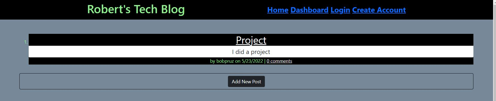

# Roberts-Tech-Blog

<!-- TABLE OF CONTENTS -->

  
Table of Contents

  <ol>
    <li><a href="#description">Description</a></li>
    <li><a href="#user-story">User Story</a></li>
    <li><a href="#built-with">Built With</a></li>
    <li><a href="#maintainer">Contributing</a></li>
    <li><a href="#license">License</a></li>
    <li><a href="#site-link">Site Link</a></li>
    <li><a href="#screenshot">Screenshot</a></li>
  </ol>

## Description

This tool is a CMS-style blog site similar to a Wordpress site, where developers can publish their blog posts and comment on other developers’ posts as well. You’ll build this site completely from scratch and deploy it to Heroku. Your app will follow the MVC paradigm in its architectural structure, using Handlebars.js as the templating language, Sequelize as the ORM, and the express-session npm package for authentication.

## User Story

AS A developer who writes about tech
I WANT a CMS-style blog site
SO THAT I can publish articles, blog posts, and my thoughts and opinions

## Built-with

JavaScript, Node, NPM, express.js

## Maintainer

<a href="mailto:bobpruz@gmail.com">Email: Robert Prusinowski</a>

## License

## Site Link

https://bobpruz-blog.herokuapp.com/

## Screenshot

